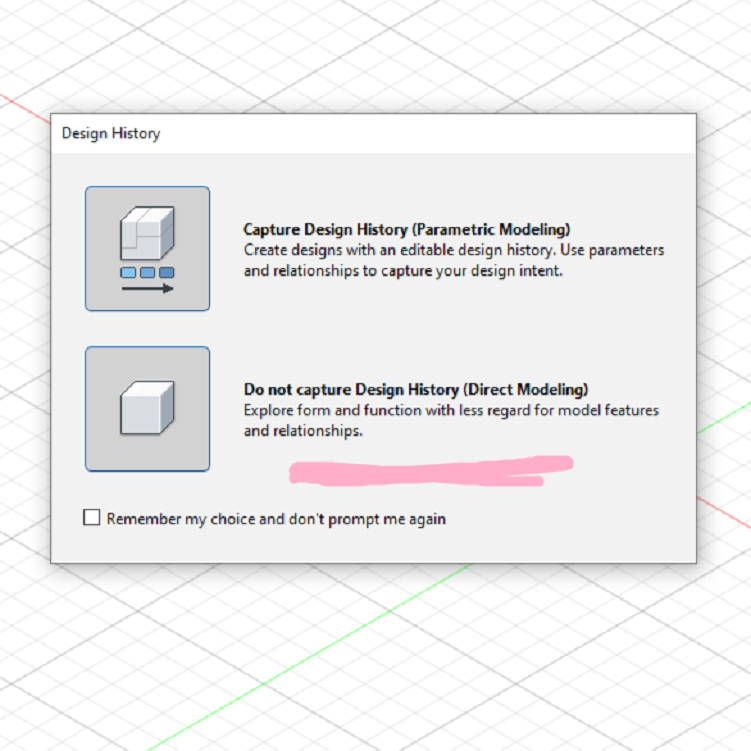

# ModularPlanting
A little tutorial for modifying stls, specifically for a modular planter, called a remix. said remixed models are also available in the models folder: [/models](./models)

Quick note, this walk through is simply how I went about it with a specific software. This is in no way an ABSOLUTE how to, because there are a hundreds of softwares plus millions of ways to do the same thing within each software

# Goal and Attribution
  This is the source for the models that need to be modified:
- [https://www.printables.com/model/669456-modular-hydroponic-tower-garden/files](https://www.printables.com/model/669456-modular-hydroponic-tower-garden/files)
- specifically, the 3-Way_Planting_Module.STEP and the 3-Way_Planting_Module_Hollow.STEP

  this is the model that has a couple features we want on the above models
- [https://www.thingiverse.com/thing:2403922](https://www.thingiverse.com/thing:2403922/files)
- specifically, the Module.stl

Always remember to check licenses, both of these each allow remixing as long as proper attribution is always accreddited, and as long as there is no commercial use. So basically, dont sell it, and dont claim it as your own.

# License
To comply with the original license from the original modes that the remix from this walk through creates, this repo and all files within is under the [Creative Commons Attribution-NonCommercial-ShareAlike 4.0 International License](https://creativecommons.org/licenses/by-nc-sa/4.0/) (CC BY-NC-SA 4.0) which is also inlcuded in this repository here: [LICENSE](./LICENSE).

# Start! Alternate Model
first, need to identifiy and measure the features we want from the alternate models.

### Importing Alternate Model
since im using f360, and since the thingiverse model doesnt give us nice modifyable step or f3d files, i will start a direct modeling project (i do not recomend using parametric timeline modelling when editing a mesh of any type, including STL)

import the alternate stl as a mesh:

and use mesh convert into body:

### Getting Dimension From Alternate Model
we want to get the internal dimension of one of these spouts, because this is the feature we want to overwrite onto the other models. to do this, create a sketch on one of the edge triangles. then make a circle with two points constrained to the two inside points of this triangle:

now you can estimate how big the circle needs to be. you can use the measure tool to get the final dimension. I rounded it to 52.7mm:

# Next! Desired Models
next, we modify the desired models with the features we identified and measured previously.

### Opening Desired models
this maker supplies both step and stl files. stl is a mesh, made of triangles. step is a bit more unique, and made of bodies. bodies are far easier to remix, so we will use these files. however, f360 has no easy way to "import" step files into an existing project. instead, they must be opened as a new project with no parametic timeline (sad)

### small tip:
if paramaetic timeline modelling is important to you, you can then save the step file as an f360 project, then import it as a compnonent into an existing project with the timeline enabled, then simply unlink the component, and edit it to your hearts content :D

if that made no sense, heres a youtube video about it: [https://www.youtube.com/watch?v=0IISPGwFQ0A](https://www.youtube.com/watch?v=0IISPGwFQ0A)

### Applying Dimension From Alternate Model To Desired Models
Zooming in, there is a flat edge we can use for our sketch profile:

add a circle to the center and use the concentric constraint to center it to the edge we used for the sketch profile (or as a shortcut, let f360 apply this constraint for you by letting it snap to the visual center, as shown)

apply the dimension we grabbed form the alternate model to this circle (52.7mm) and finish the sketch. do this for all 3 spouts, on both models

### Creating Spout From Sketch
extrude your new sketch profile AND the outer edge (this will be useful later) long enough that all edges are fully inside the inner tube of the model (-80mm) MAKE SURE ITS A NEW BODY and do this for all 3 spouts, on both models:

it should look like this, but for all 3 sketch profiles, and on both models:

### Split The New Bodies
use the inner tube as a plane to cut the new bodies you just made form the earlier extrusion. do this split for each body, on both models:

then select the bodies inside the tube and remove them do this for all 3 bodies on both models:

the inside should look like this now:

### Join The Leftover Bodies
combine the leftover bodies with the main object, do this for both models

### Add Fillets (OPTIONAL)
zooming in, you can see there used to be an internal fillets to round out the edge here:

which is not present on our model anymore:

add a fillet to the entire edge if so desired. however, zooming in again, you can also see that a 3mm fillet is not enough to cover a slight surface indent, this indent is from the previous fillet. the indent would have been alot bigger if the edge was not selected in the much earlier extrude step!:

a fillet of 4mm completly covers it, making th emodel look nice and pretty:

# Finished!
and that is all! export in whatever format you prefer. enjoy!

the results of this walkthrough can be found in the models folder here: [/models](./models)
